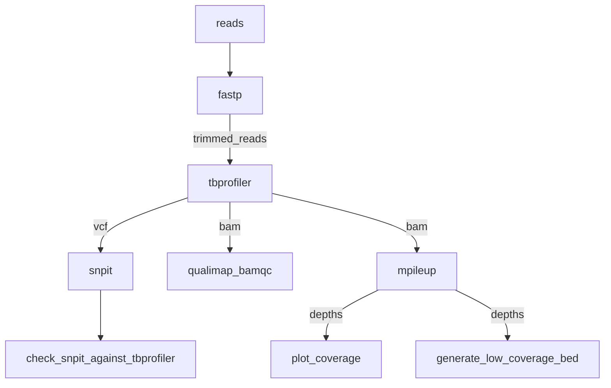

# TBProfiler-NF: A Nextflow Wrapper for the TBProfiler Mycobacteria Genomics Analysis Tool

This is a Nextflow-based wrapper for the [TBProfiler](https://github.com/jodyphelan/TBProfiler) pipeline for antimicrobial resistance (AMR)
analysis of whole-genome sequence data for Mycobacteria tuberculosis complex samples. This pipeline provides a convenient way to analyze
many samples at once, on an HPC cluster system. It also integrates additional QC analysis of the input data using [fastp](https://github.com/OpenGene/fastp),
and of the generated alignments using [Qualimap](https://github.com/scchess/Qualimap).



## Usage

```
nextflow run BCCDC-PHL/tbprofiler-nf \
  --fastq_input <fastq_input_dir> \
  --outdir <output_dir>
```

### Parameters

| Flag                         | Default Value | Description                                       |
|:-----------------------------|--------------:|:--------------------------------------------------|
| `min_depth`                  |            10 | Minimum depth of coverage used to call a SNP      |
| `min_af_used_for_calling`    |           0.1 | Minimum minor allele fraction used to call a SNP  |
| `min_af_used_for_prediction` |           0.1 | Minimum minor allele fraction used to predict AMR |


## Output

An output directory will be created for each sample under the directory provided for the `--outdir` flag.

The following files will be produced for each sample:

```
.
└── sample-01
    ├── sample-01_TIMESTAMP_provenance.yml
    ├── sample-01_coverage_plot.png
    ├── sample-01_fastp.csv
    ├── sample-01_fastp.json
    ├── sample-01_low_coverage_regions.bed
    ├── sample-01_qualimap_alignment_qc.csv
    ├── sample-01_snpit.tsv
    ├── sample-01_snpit_unchecked.tsv
    ├── sample-01_tbprofiler.bam
    ├── sample-01_tbprofiler.bam.bai
    ├── sample-01_tbprofiler_full_report.csv
    ├── sample-01_tbprofiler_full_report.json
    ├── sample-01_tbprofiler_lineage.csv
    ├── sample-01_tbprofiler_resistance.csv
    ├── sample-01_tbprofiler_resistance_mutations.csv
    ├── sample-01_tbprofiler_summary.csv
    ├── sample-01_tbprofiler_targets.vcf
    └── sample-01_tbprofiler_whole_genome.vcf
```


## Provenance

In the output directory for each sample, a provenance file will be written with the following format:

- pipeline_name: BCCDC-PHL/tbprofiler-nf
  pipeline_version: 0.2.2
  nextflow_session_id: ee5b4986-6ada-4eab-a294-ed0cbb18427d
  nextflow_run_name: furious_murdock
  analysis_start_time: 2024-02-01T16:37:26.062501-08:00
- input_filename: SAMPLE-ID_S133_L001_R1_001.fastq.gz
  file_type: fastq-input
  sha256: 1b6a9a616ec3fd8432ff02f51d60fb6443617c29761b96234ede9c65efe06547
- input_filename: SAMPLE-ID_S133_L001_R2_001.fastq.gz
  file_type: fastq-input
  sha256: f6954b1a174fbead8a035ae7cdfda549fcc751be8847a330505df49de59bed96
- process_name: fastp
  tools:
    - tool_name: fastp
      tool_version: 0.23.2
      parameters:
        - parameter: --cut_tail
          value: null
- process_name: tbprofiler
  tools:
    - tool_name: tb-profiler
      database_version: tbdb_4738132_Jody Phelan <jody.phelan@lshtm.ac.uk>_Thu Jul 21 16:19:40 2022 +0100
      tool_version: 4.3.0
      subcommand: profile
      parameters:
        - parameter: --platform
          value: illumina
        - parameter: --mapper
          value: bwa
        - parameter: --caller
          value: bcftools
        - parameter: --af
          value: 0.1
        - parameter: --reporting_af
          value: 0.1
        - parameter: --prefix
          value: 23s629
        - parameter: --csv
          value: null
        - parameter: --call_whole_genome
          value: null
- process_name: snpit
  tools:
    - tool_name: snpit
      tool_version:  1.0.0
      parameters:
        - parameter: --input
          value: 23s629_tbprofiler_whole_genome.vcf
